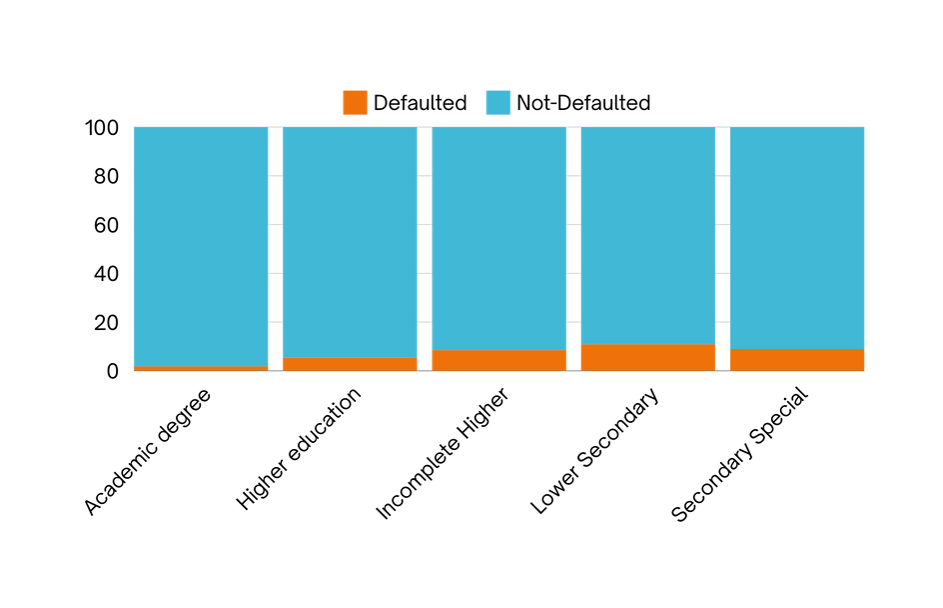
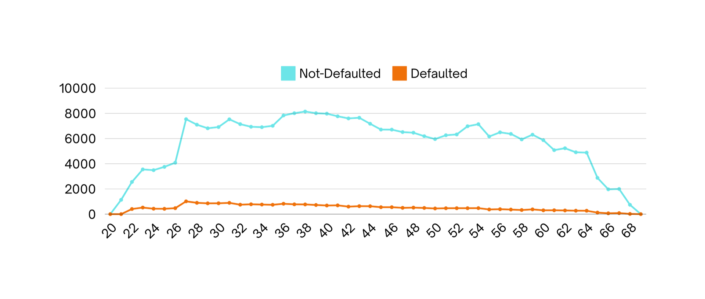

# Home Credit Risk Prediction

## Project Overview

This project aims to leverage existing data to predict loan eligibility and identify customers at risk of defaulting on payments. By utilizing the **PyCaret** library, an open-source, low-code machine learning tool, the project simplifies the process of model training and evaluation. PyCaret enables rapid experimentation with various machine learning models, streamlining the workflow for data scientists and analysts. By using PyCaret, the project can efficiently compare model performance, automate hyperparameter tuning, and enhance overall productivity, all while minimizing potential losses from defaults.

## Problem Statement

Home Credit has numerous customers seeking loans and needs an effective system to assess their repayment capabilities. The project focuses on predicting customers likely to default, thereby reducing potential financial losses while adhering to regulatory conditions.

## Goals

- **Primary Goal:** Predict which clients are likely to default on loan payments and reduce company losses.
- **Objective:** Build predictive models to identify potential clients who can repay loans and classify those at risk of default.

## Metrics

- **Default Rate:** The percentage of loans that go into default. A lower rate indicates better model performance and risk assessment.

## Data Preprocessing

- **Datasets:** 
  - `application_train`: 122 features, 307,511 rows (includes TARGET variable)
  - `application_test`: 121 features, 48,744 rows (does not include TARGET variable)

## Exploratory Data Analysis (EDA)

- **Techniques Used:** Multivariate and bivariate analysis to explore relationships within the data.

## Data Preparation

- **Tasks:**
  - Handling missing values
  - Feature encoding
  - Addressing class imbalance using SMOTE (Synthetic Minority Over-sampling Technique)

## Modeling

- **Models Used:** Logistic Regression and Decision Tree
- **Process:** Train, evaluate, tune, and compare models using PyCaret for streamlined workflows.

## Business Insights & Recommendations

### Default Rate Analysis

- **Overall Default Rate:** 8%, indicating an imbalanced dataset.
  
#### Contract Type Insights

- **Default Rate by Contract Type:** Cash loans have a higher default rate than revolving loans. 
  - **Recommendation:** Consider offering lower interest rates for revolving loans to increase revenue.

#### Education Type Insights

- **Default Rate by Education Type:** Higher Education borrowers have a lower default rate (5.3%) compared to Secondary Special (8.2%).
  - **Recommendation:** Invest in financial literacy programs targeting Secondary Special borrowers to improve repayment rates.

#### Age Insights

- **Default Rate Trends by Age:** Increases with age, peaking at 8.3% for ages 36-40. 
  - **Recommendations:** 
    - Implement targeted financial literacy programs for borrowers aged 31-40.
    - Create tailored loan products for this age group.

#### Gender Insights

- **Default Rates by Gender:** Female borrowers (7.0%) have a lower default rate compared to male borrowers (10.1%).
  - **Recommendations:** 
    - Focus marketing efforts on female borrowers.
    - Develop support and financial literacy programs for male borrowers.

## Machine Learning Implementation & Evaluation

### Model Metrics

| Model                     | AUC   | Recall |
|---------------------------|-------|--------|
| Tuned Logistic Regression  | 70%   | 58.6%  |
| Tuned Decision Tree       | 55.2% | 61.2%  |

### Model Interpretation

- **Confusion Matrix for Logistic Regression:**
  - Actual Class 0: 59,706 (True Negatives), 25,100 (False Positives)
  - Actual Class 1: 3,002 (False Negatives), 4,446 (True Positives)

- **Insights:** The recall of 59.6% indicates that approximately 40.4% of actual defaults are missed. With an AUC of 0.70, the model shows reasonable performance for risk assessment, aiding informed lending decisions.

## Conclusion

This project highlights the importance of predictive analytics in the lending industry. By identifying loan default risks, Home Credit can improve risk assessment and financial performance while supporting responsible lending practices.